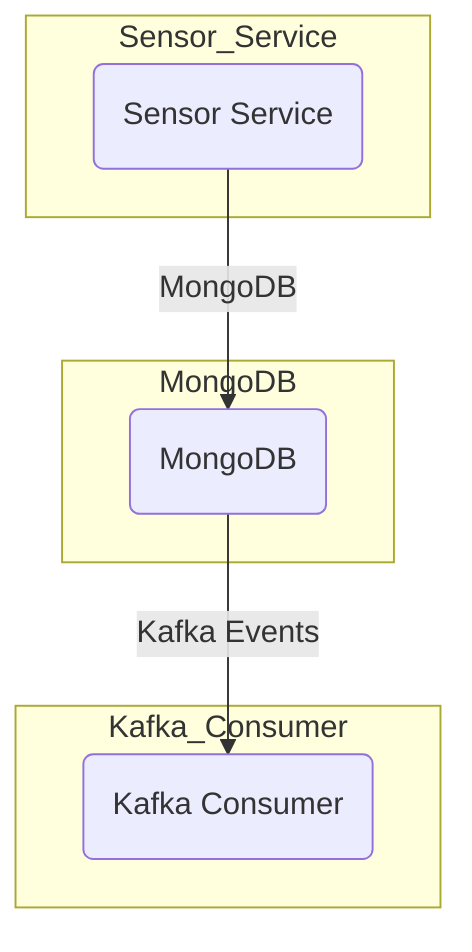

```mermaid
graph TD
  subgraph Sensor_Service
    A(Sensor Service)
  end

  subgraph MongoDB
    B(MongoDB)
  end

  subgraph Kafka_Consumer
    C(Kafka Consumer)
  end

  A -->|MongoDB| B
  B -->|Kafka Events| C
```